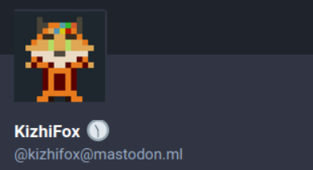

# In-nickname clock for Mastodon

This script adds the clock to your Mastodon username that shows the current time!



Usage: `clock.py \<display name\> \<server name (e.g. mastodon.example)\> \<access token\>`

Example:

```bash
> python clock.py KizhiFox mastodon.ml qwertyuiopasdfghjklzxcvbnm1234567890
🕦  11:43
🕛  12:00
🕧  12:30
🕐  13:00
🕜  13:30
```

To run this script you need to create an app with `write:accounts` permission.
